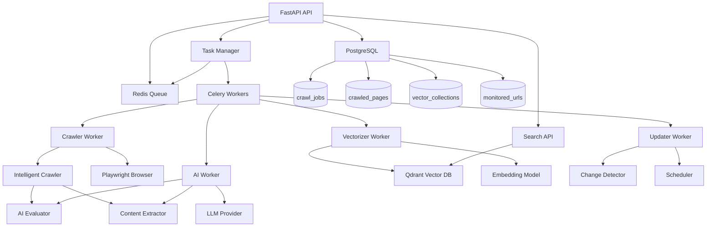

# System Dependencies and Architecture

## 🔗 Component Dependencies Graph



## 📦 Service Dependencies

### 1. API Service
**Depends on:**
- Redis (for task queuing)
- PostgreSQL (for metadata storage)
- Celery (for task distribution)

**Provides to:**
- External clients (REST API)
- Admin interface
- Monitoring systems

**Key Files:**
```
api/
├── main.py              # FastAPI app initialization
├── dependencies.py      # Shared dependencies (Redis, DB, TaskManager)
└── routers/
    ├── crawl.py        # Crawl job management
    ├── search.py       # Content search
    ├── admin.py        # Administration
    └── health.py       # Health checks
```

### 2. Crawler Worker
**Depends on:**
- Redis (for job queue)
- Playwright (for browser automation)
- AI Evaluator (for content scoring)
- PostgreSQL (for storing results)

**Provides to:**
- Crawled page content
- Extracted structured data
- Link discovery

**Key Files:**
```
crawler/
├── intelligent_crawler.py  # Main crawling logic
├── tasks.py               # Celery task definitions
└── strategies/            # Different crawling strategies (TODO)
```

### 3. AI Worker
**Depends on:**
- LLM Provider (OpenAI/Anthropic)
- Redis (for job queue)
- Core models

**Provides to:**
- Content evaluation scores
- Structured data extraction
- Content classification

**Key Files:**
```
ai/
├── evaluator.py          # Content evaluation logic
├── extractor.py          # Intelligent extraction
├── summarizer.py         # Summary generation (TODO)
└── tasks.py             # Celery task definitions
```

### 4. Vectorizer Worker
**Depends on:**
- Qdrant (vector storage)
- OpenAI Embeddings API
- Redis (for job queue)
- PostgreSQL (for metadata)

**Provides to:**
- Vector embeddings
- Semantic search capability
- Collection management

**Key Files:**
```
vectorizer/
├── tasks.py             # Vectorization tasks
├── embedder.py          # Embedding generation (TODO)
└── collection_manager.py # Qdrant collection management (TODO)
```

### 5. Updater Worker
**Depends on:**
- PostgreSQL (for monitored URLs)
- Crawler Worker (for re-crawling)
- Change Detector

**Provides to:**
- Content freshness monitoring
- Change notifications
- Update scheduling

**Key Files:**
```
updater/
├── scheduler.py         # Update scheduling logic
├── change_detector.py   # Content change detection
└── tasks.py            # Update tasks (TODO)
```

## 🔧 Core Module Dependencies

### core/models.py
**Used by:** All components
**Defines:**
- `CrawlConfig` - Crawling configuration
- `PageContent` - Extracted page content
- `ContentEvaluation` - AI evaluation results
- `CrawlJob` - Job tracking
- `VectorDocument` - Vectorization format

### core/config.py
**Used by:** All components
**Provides:**
- Environment configuration
- Service URLs
- API keys management
- Default settings

### core/llm.py
**Used by:** AI Worker
**Provides:**
- LLM provider abstraction
- OpenAI/Anthropic integration
- Prompt management
- Token counting

### core/celery_config.py
**Used by:** All workers
**Provides:**
- Task routing configuration
- Queue definitions
- Worker settings

## 🗄️ Database Schema Dependencies

### PostgreSQL Tables

```sql
-- crawl_jobs table
CREATE TABLE crawl_jobs (
    id UUID PRIMARY KEY,
    status VARCHAR(50),
    urls TEXT[],
    config JSONB,
    created_at TIMESTAMP,
    completed_at TIMESTAMP,
    stats JSONB
);

-- crawled_pages table
CREATE TABLE crawled_pages (
    id UUID PRIMARY KEY,
    job_id UUID REFERENCES crawl_jobs(id),
    url TEXT,
    title TEXT,
    content_hash VARCHAR(64),
    content_type VARCHAR(50),
    ai_scores JSONB,
    extracted_data JSONB,
    crawled_at TIMESTAMP
);

-- vector_collections table
CREATE TABLE vector_collections (
    id UUID PRIMARY KEY,
    name VARCHAR(100) UNIQUE,
    config JSONB,
    created_at TIMESTAMP
);

-- monitored_urls table
CREATE TABLE monitored_urls (
    id UUID PRIMARY KEY,
    url TEXT UNIQUE,
    check_frequency INTERVAL,
    last_checked TIMESTAMP,
    last_hash VARCHAR(64),
    change_history JSONB[]
);
```

### Redis Keys Structure

```
crawl_job:{job_id}          # Job status and progress
celery-task-meta-{task_id}  # Celery task metadata
crawler:queue               # Crawler task queue
ai:queue                    # AI task queue
vectorizer:queue            # Vectorizer task queue
updater:queue               # Updater task queue
```

### Qdrant Collections

```
default                     # Default content collection
immigration                 # Immigration-specific content
work_permits               # Work permit content
study_permits              # Study permit content
```

## 🔌 External Service Dependencies

### 1. OpenAI API
- **Used for:** Embeddings, content evaluation
- **Endpoints:** 
  - `/v1/embeddings` (text-embedding-3-small)
  - `/v1/chat/completions` (gpt-4-turbo)
- **Rate limits:** 10,000 TPM

### 2. Anthropic API
- **Used for:** Alternative LLM provider
- **Endpoints:**
  - `/v1/messages` (claude-3-opus)
- **Rate limits:** 100,000 TPD

### 3. Playwright
- **Used for:** Browser automation
- **Browsers:** Chromium (headless)
- **Resources:** ~200MB per instance

## 🐳 Docker Service Dependencies

```yaml
services:
  api:
    depends_on:
      - redis
      - postgres
      - qdrant
    
  crawler-worker:
    depends_on:
      - redis
      - postgres
    
  ai-worker:
    depends_on:
      - redis
    
  vectorizer-worker:
    depends_on:
      - redis
      - qdrant
    
  updater:
    depends_on:
      - redis
      - postgres
```

## 📝 Configuration File Dependencies

### Required Environment Variables
```
# Database
POSTGRES_URL
REDIS_URL
QDRANT_URL

# API Keys
OPENAI_API_KEY
ANTHROPIC_API_KEY

# Service Config
LLM_PROVIDER (openai/anthropic)
EMBEDDING_MODEL
CRAWLER_MAX_CONCURRENT
```

### Configuration Files
```
config/
├── domains/              # Domain-specific crawl configs
│   ├── default.yaml
│   └── immigration.yaml
├── extraction/          # Extraction schemas
│   └── schemas.yaml
└── prompts/            # LLM prompts
    ├── evaluation.yaml
    └── extraction.yaml
```

## 🔄 Data Flow Dependencies

1. **Crawl Request Flow**
   ```
   API → Redis Queue → Crawler Worker → AI Evaluator → PostgreSQL
                                      ↓
                                 Content Extractor → Vectorizer Queue
   ```

2. **Vectorization Flow**
   ```
   Vectorizer Queue → Vectorizer Worker → Embedding API → Qdrant
                                        ↓
                                   PostgreSQL (metadata)
   ```

3. **Search Flow**
   ```
   Search API → Qdrant (vector search) → Result Ranking → Response
              ↓
         PostgreSQL (metadata)
   ```

4. **Update Flow**
   ```
   Scheduler → Monitored URLs → Change Detector → Crawler Queue
                              ↓
                         Notification System
   ```

## 🚨 Critical Dependencies

1. **Redis** - System fails without task queue
2. **PostgreSQL** - No metadata storage
3. **LLM API Keys** - AI features disabled
4. **Playwright** - No JavaScript rendering

## 📊 Performance Dependencies

- **Crawler concurrency** depends on Playwright browser pool size
- **Vectorization speed** depends on embedding API rate limits
- **Search speed** depends on Qdrant index configuration
- **AI evaluation** depends on LLM API latency

---

*Last Updated: 2025-06-19*
*Version: 1.0.0*